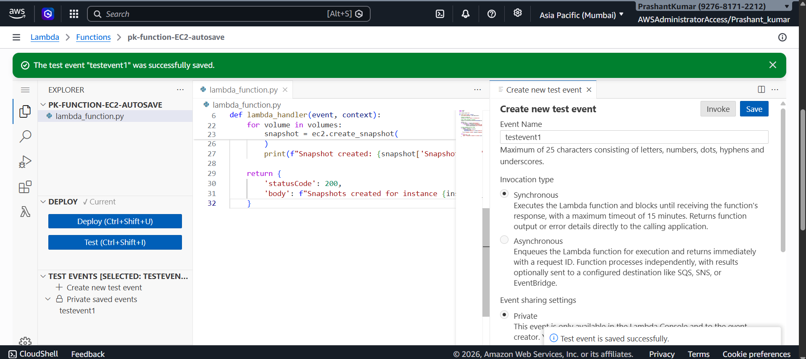
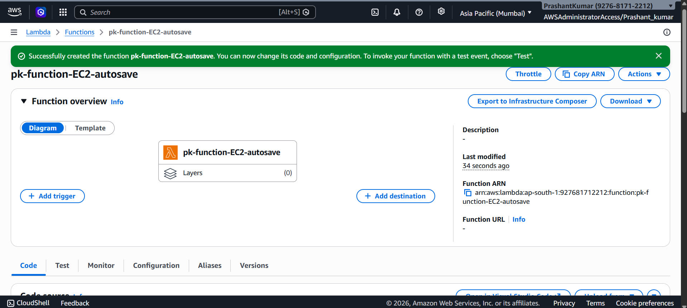
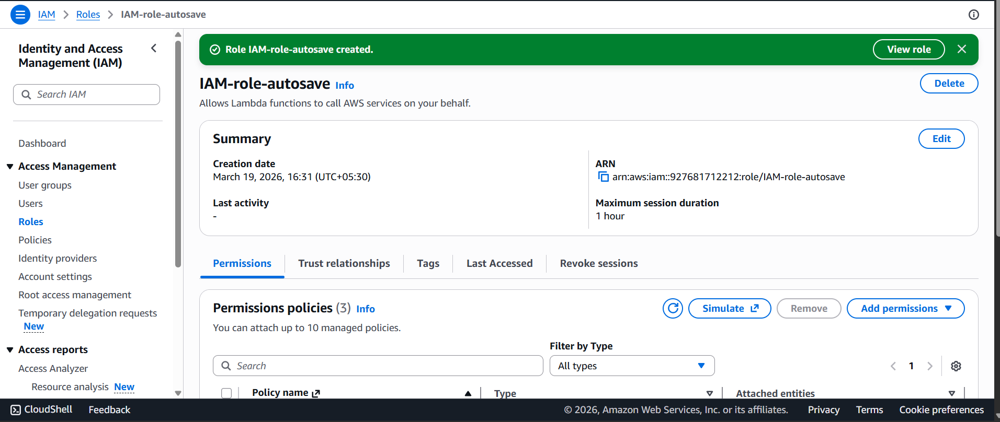
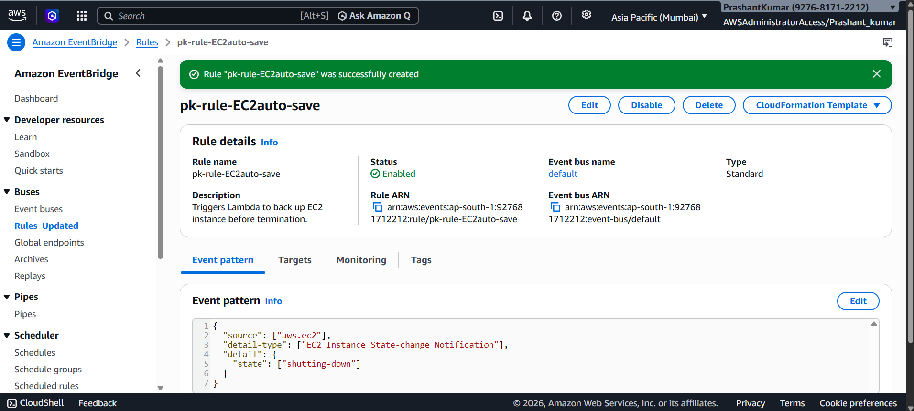
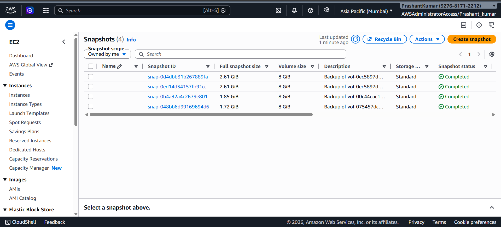
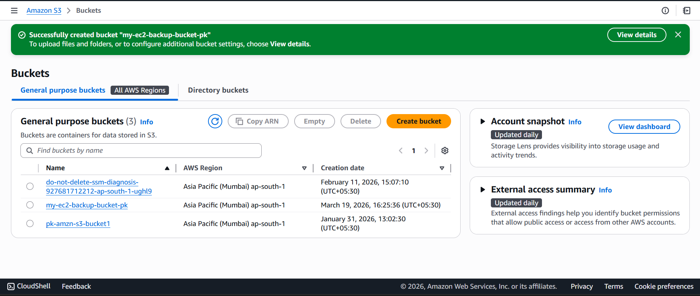
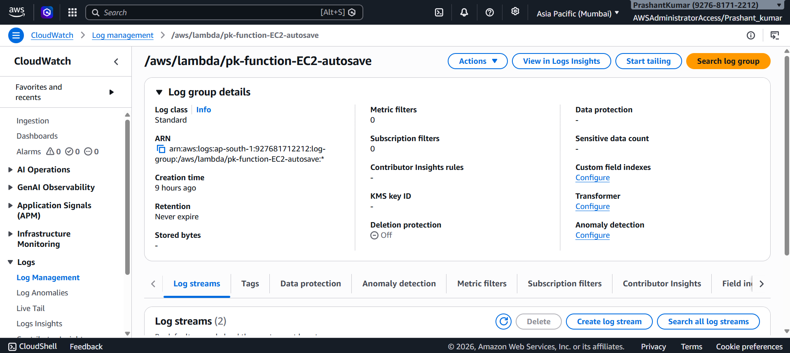

# Assignment 18: Autosave EC2 Instance State Before Shutdown

## Objective
Automatically save EC2 instance data before shutdown using Lambda and EventBridge.

---

## Services Used
- AWS Lambda
- Amazon EC2
- Amazon EventBridge
- Amazon CloudWatch
- Amazon S3

---

## Architecture
EventBridge detects EC2 shutdown → triggers Lambda → Lambda creates snapshot

---

## Steps

1. Created Lambda function using Python (Boto3)
2. Configured IAM Role with EC2 permissions
3. Created EventBridge rule for EC2 state change
4. Set target as Lambda function
5. Tested by stopping EC2 instance
6. Snapshot created successfully

---

## Screenshots

### Event Trigger

### Lambda Function

### IAM Role

### EventBridge Rule

### Snapshot Created

### S3 Bucket

### CloudWatch Logs

---

## Output
EC2 instance data is automatically backed up before shutdown using snapshots.
